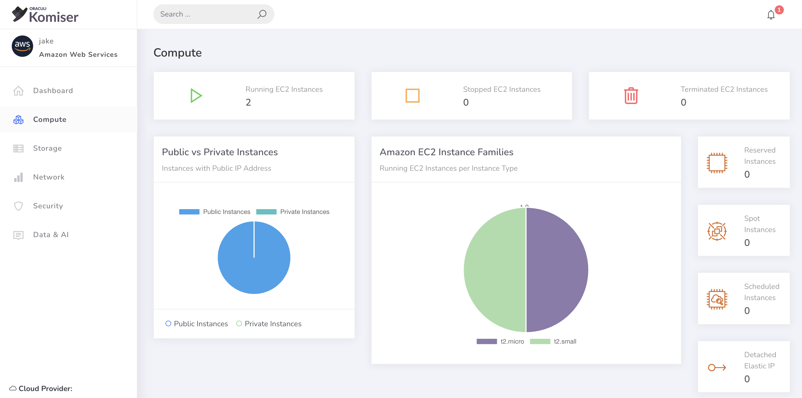

# Optimizing EC2

**`How-to: Komiser` Optimizing EC2**

Under the `Compute` tab on the sidebar you can view the first half of the page which shows the most relevant EC2 data in your AWS account. 
Check out the video below to learn some tips, which applied alongside Komiser can greatly reduce your EC2 spend. 

 
### Watch the EC2 optimization video: 

  <iframe
    src='https://www.youtube.com/embed/w2aV0apBIOk'
    allowFullScreen
    webkitallowfullscreen="true"
    frameBorder="0"
    style={{
      position: 'absolute',
      top:0,
      left:0,
      width:'100%',
      height:'100%',
    }}
  >
  </iframe>

### EC2 savings `cheatsheet`:
Cheatsheet to keep in mind when reducing EC2 costs
- Utilize **SPOT instances** as much as possible.
- Have a `Reserved` instance % target.
- **Update** the version of you instance type **regularly**.
- Be sure to not leave instances running when not needed
- Choose ARM64 architecture if your workload run on it.  
- Consider running AWS Compute Optimiser to learn if you are deploying the right instance famalies for your instances. 