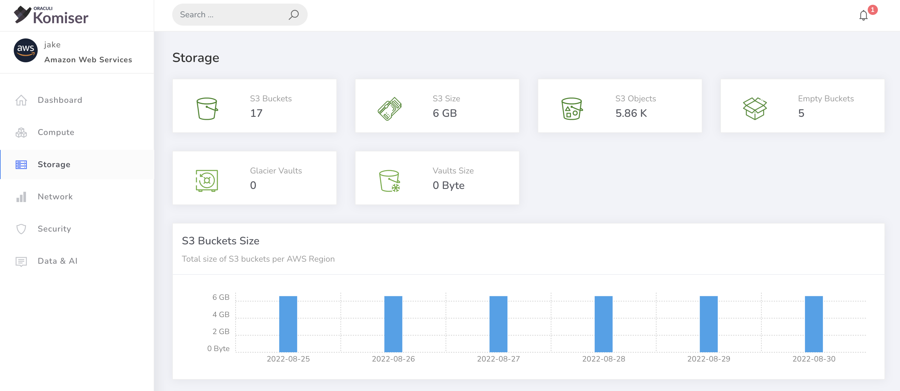
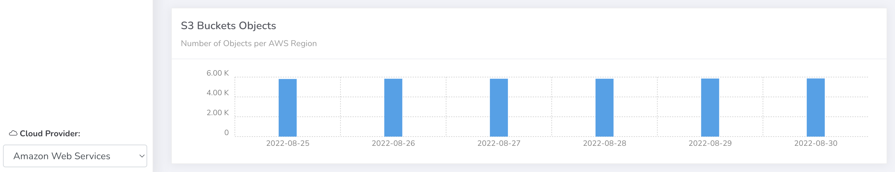

# Optimizing S3

**`How-to: Komiser` Optimizing S3**

Under the `Storage` tab on the sidebar you can view the first half of the page which shows the most relevant S3 data in your AWS account.

On the lower part of the `storage` page we can see the S3 bucket objects in more detail.

Check out the video below to learn some tips, which applied alongside Komiser can greatly reduce your S3 spend.

### Watch the S3 optimization video:

  <iframe
    src='https://www.youtube.com/embed/9pCimmIT-HQ'
    allowFullScreen
    webkitallowfullscreen="true"
    frameBorder="0"
    style={{
      position: 'absolute',
      top:0,
      left:0,
      width:'100%',
      height:'100%',
    }}
  >
  </iframe>

### S3 savings `cheatsheet`:

Cheatsheet to keep in mind when reducing S3 costs

- If you are using the `Standard` storage tier, make sure tou have a good reason why.
- Have a lifecyle policy to bucket objects that makes sense for your application, **make the most of the AWS infrequent access tiers.**
- If you store large compressed file, consider using [zstd](http://facebook.github.io/zstd/) instead of any other compression format.
- Use Komiser to know exaclty how much S3 memory you are using, and make sure you are in the tier that best suits each object.
