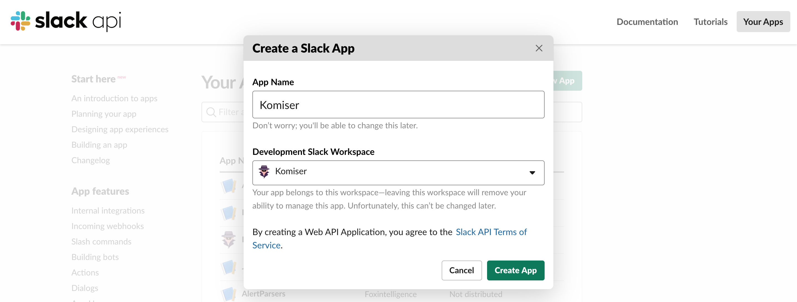
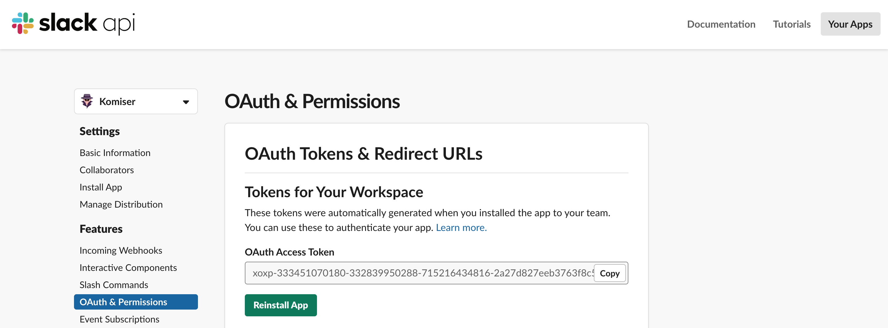

# Daily Budget Alert

Head over to [Your Apps](https://api.slack.com/slack-apps-preview) and click the green “**Create New App**” button. A dialog like this will pop up:

## Generate OAuth Token:

## Add permissions:
Add the below permissions scopes and reinstall the app in the target workspace:

On [Komiser EE Dashboard](https://cloud.komiser.io), navigate to "**Dashboard**" section:

## Create alert:
Click on "**Create Alert**" button:

Fill out the form and click on create:

That's it, you will receive everyday (9am GMT) a slack notification with the current monthly cost of each cloud account configured on your Komiser EE account:

